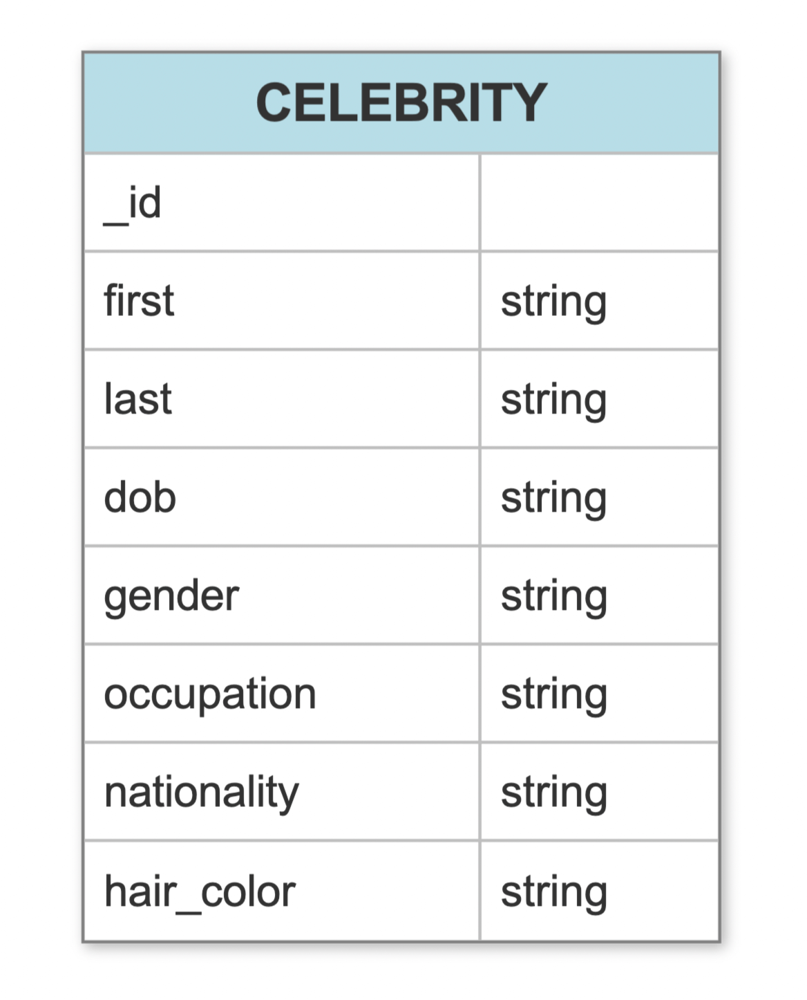

# MongoDB Mini Project

This project was created as part of the lessons on MongoDB and Python with the Code Institute. The MongoDB mini project allows users full CRUD functionality with the database through the command line terminal using python.

- - -

## CONTENTS

* [User Experience](#User-Experience)
  * [User Stories](#User-Stories)

* [Design](#Design)
  * [Database Schema](#Database-Schema)
  * [Features](#Features)

* [Technologies Used](#Technologies-Used)
  * [Languages Used](#Languages-Used)
  * [Frameworks, Libraries & Programs Used](#Frameworks,-Libraries-&-Programs-Used)

* [Deployment & Local Development](#Deployment-&-Local-Development)
  * [Local Development](#Local-Development)
    * [How to Fork](#How-to-Fork)
    * [How to Clone](#How-to-Clone)

* [Testing](#Testing)
  
* [Credits](#Credits)
  * [Code Used](#Code-Used)

- - -

## User Experience

### User Stories

* As a user, I want the menu to be easy to navigate.
* As a user, I want to be able to create a new record in the database.
* As a user, I want to be able to view records in the database.
* As a user, I want to be able to edit records in the database.
* As a user, I want to be able to delete records in the database.

- - -

## Design

### Database Schema

The database schema was created with [smartdraw](https://www.smartdraw.com/).

### Features

The application is comprised of a menu with 5 options.

1. Add a record.

   This menu option allows users to add a record to the database. Once option 1 has been selected, the user will be guided to input the following information: first name, last name, date of birth, gender, hair colour, occupation and nationality.

   Once these fields have been entered, the user receives feedback to let them know that the document has been inserted into the database and then the menu options are displayed again.

   If there is an error with adding the record the user will be shown an error message letting them know that there was an error accessing the database.

   

2. Find a record by name.

   This menu option allows users to find a record by inputting a name. Once option 2 has been selected the user will be prompted to enter the first name and then the last name of the record they are searching for.

   If the record exists, the user will be shown the full record.

   If there is an issue with finding the record, an error message will be displayed stating: Error! No results found. The menu is then displayed.

   

3. Edit a record.

   This menu option allows users to edit a record that already exists in the database. Once option 3 has been selected the user will be prompted to enter a first and last name for the record they would like to edit.

   The user is then taken through each attribute in the record - displaying the key and the current value of the key. The user may edit or press enter to keep the current value. Once completed the user will be shown a document updated message to let them know that the edit has been successful and then the menu options will be displayed.

   If there is a problem, the user will be shown an error message letting them know there was an error accessing the database.

   

4. Delete a record.

   This menu option allows users to delete a record from the database. Once option 4 has been selected the user will be prompted to enter the first and last name of the record they would like to delete from the database. They will then be shown the full record for the person and they will be asked whether this is the document they wanted to delete.

   If the user selects `y` they will be shown a message to let them know that the document has been deleted. If the user selects `n` they will be shown a message to let them know the document has not been deleted. If the user imputs any character other than a `y` or `n` they will be shown the message document not deleted. If there is an issue with deleting a record the user will be shown an error message stating: error accessing the database.

   

5. Exit the menu.

   If this option is selected the user is exited out of the mongo_project.py application.

- - -

## Technologies Used

### Languages Used

Python

### Frameworks, Libraries & Programs Used

Git - For version control.

Github - To save and store the files for the website.

MongoDB - For the Database

PyMongo - A tool to allow us to be able to use the MongoDB with Python.

[smartdraw](https://www.smartdraw.com/) - To create the database schema.

[Tiny PNG](https://tinypng.com/) To compress images used in the readme.

[Shields.io](https://shields.io/) To add badges to the README

- - -

## Local Development

### Local Development

#### How to Fork

To fork the repository:

1. Log in (or sign up) to Github.
2. Go to the repository for this project, [mongodb-miniproject](https://github.com/kera-cudmore/mongodb-miniproject).
3. Click the Fork button in the top right corner.

#### How to Clone

To clone the repository:

1. Log in (or sign up) to GitHub.
2. Go to the repository for this project, [mongodb-miniproject](https://github.com/kera-cudmore/mongodb-miniproject).
3. Click on the code button, select whether you would like to clone with HTTPS, SSH or GitHub CLI and copy the link shown.
4. Open the terminal in your code editor and change the current working directory to the location you want to use for the cloned directory.
5. Type 'git clone' into the terminal and then paste the link you copied in step 3. Press enter.

- - -

## Testing

Please see [testing.md](testing.md) for all testing performed
- - -

## Credits

### Code Used

This project was created as part of a walkthrough project with the Code Institute for a unit on MongoDB and python.
